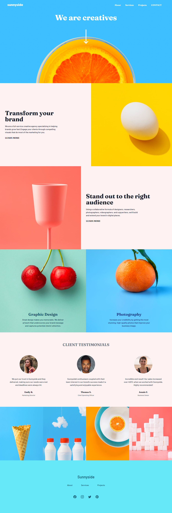
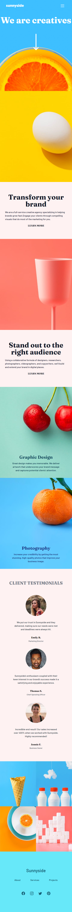

# Frontend Mentor - Sunnyside agency landing page solution

This is a solution to the [Sunnyside agency landing page challenge on Frontend Mentor](https://www.frontendmentor.io/challenges/sunnyside-agency-landing-page-7yVs3B6ef). Frontend Mentor challenges help you improve your coding skills by building realistic projects.

## Table of contents

- [Overview](#overview)
  - [The challenge](#the-challenge)
  - [Screenshot](#screenshot)
  - [Links](#links)
- [My process](#my-process)
  - [Built with](#built-with)
  - [What I learned](#what-i-learned)
  - [Useful resources](#useful-resources)
- [Author](#author)


## Overview

### The challenge

Users should be able to:

- View the optimal layout for the site depending on their device's screen size
- See hover states for all interactive elements on the page

### Screenshot





### Links

- Solution URL: [solution url](https://github.com/muubaraq/Sunnysideagencylandingpage)
- Live Site URL: [live site](https://muubaraq.github.io/Sunnysideagencylandingpage/)

## My process

### Built with

- Semantic HTML5 markup
- CSS custom properties
- Flexbox
- Mobile-first workflow
- JavaScript
- Tailwind CSS

### What I learned

The Sunny Side landing page project was a valuable learning experience for me as a web developer. I learned how to work with columns to create responsive layouts, effectively use flexbox for flexible and efficient layout design, implement a functional mobile hamburger menu for improved user experience, and utilize text decorations to enhance the visual appearance of the content. These learnings have greatly enhanced my skillset and expanded my toolkit for creating modern and interactive web pages. I look forward to applying these techniques in my future projects and continuing my journey of learning and growth as a web developer.

```html
<div class="transform-text flex-1 flex flex-col justify-center px-10 py-20 sm:items-start items-center bg-red-50">
        <h2 class="text-5xl text-center sm:text-start text-gray-900"> Transform your <br>brand</h2>
        <p class="w-[430px] py-5 text-gray-700">We are a full-service creative agency specializing in helping brands grow fast.Engage your clients through compelling visuals that do most of the marketing for you.</p>
        <a href="#" class="text-gray-900 hover:underline hover:underline-offset-[1]
        hover:decoration-yellow-300 hover:decoration-8  font-bold">LEARN MORE</a>
      </div>
```


### Useful resources

- [w3schools](https://www.w3schools.com/cssref/pr_text_text-decoration-thickness.php) - This helped me with text decoration and offset.

## Author
- Frontend Mentor - [@muubaraq](https://www.frontendmentor.io/profile/muubaraq)
- Twitter - [@muubaraq](https://www.twitter.com/muubaraq)